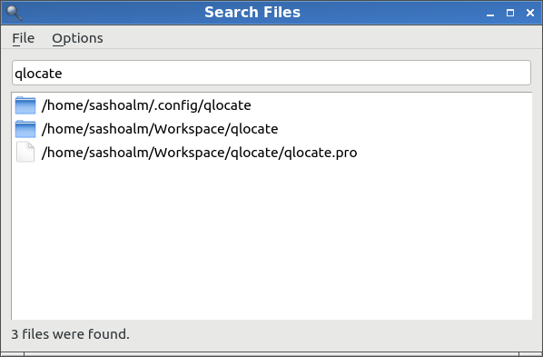

QLocate is a thin wrapper over Linux's updatedb/locate cmd line tools.

To build it, run:

	qmake
	make

After building it, you can run it with this command (inside the project folder):

	./qlocate
	
To install it, type this:

	sudo install qlocate /usr/local/bin/

Screenshot:

